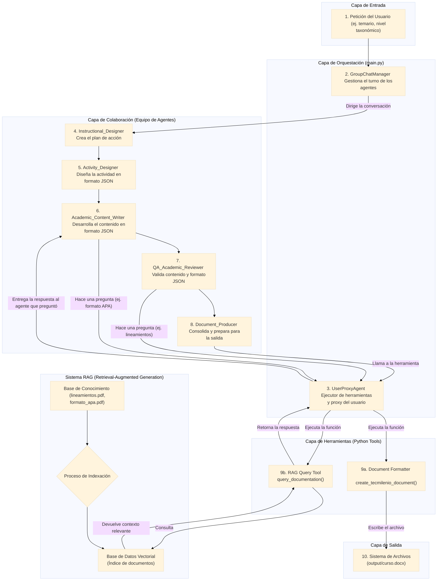

```mermaid
%%{
  init: { "theme": "base" }
}%%
graph TD
    subgraph "Capa de Entrada"
        A["1. Petición del Usuario <br> (ej. temario, nivel taxonómico)"]
    end

    subgraph "Capa de Orquestación (main.py)"
        B["2. GroupChatManager <br> Gestiona el turno de los agentes"]
        C["3. UserProxyAgent <br> Ejecutor de herramientas y proxy del usuario"]
    end

    subgraph "Capa de Colaboración (Equipo de Agentes)"
        D["4. Instructional_Designer <br> Crea el plan de acción"] --> E["5. Activity_Designer <br> Diseña la actividad en formato JSON"]
        E --> F["6. Academic_Content_Writer <br> Desarrolla el contenido en formato JSON"]
        F --> G["7. QA_Academic_Reviewer <br> Valida contenido y formato JSON"]
        G --> H["8. Document_Producer <br> Consolida y prepara para la salida"]
    end

    subgraph "Capa de Herramientas (Python Tools)"
        I["9a. Document Formatter <br> create_tecmilenio_document()"]
        J["9b. RAG Query Tool <br> query_documentation()"]
    end

    subgraph "Sistema RAG (Retrieval-Augmented Generation)"
        K["Base de Conocimiento <br> (lineamientos.pdf, formato_apa.pdf)"] --> L{"Proceso de Indexación"}
        L --> M["Base de Datos Vectorial <br> (Índice de documentos)"]
    end

    subgraph "Capa de Salida"
        N["10. Sistema de Archivos <br> (output/curso.docx)"]
    end

    %% Flujo Principal
    A --> B
    B -- "Dirige la conversación" --> D

    %% Flujo de Herramienta de Documento
    H -- "Llama a la herramienta" --> C
    C -- "Ejecuta la función" --> I
    I -- "Escribe el archivo" --> N

    %% Flujo de Herramienta RAG
    F -- "Hace una pregunta (ej. formato APA)" --> C
    G -- "Hace una pregunta (ej. lineamientos)" --> C
    C -- "Ejecuta la función" --> J
    J -- "Consulta" --> M
    M -- "Devuelve contexto relevante" --> J
    J -- "Retorna la respuesta" --> C
    C -- "Entrega la respuesta al agente que preguntó" --> F

```